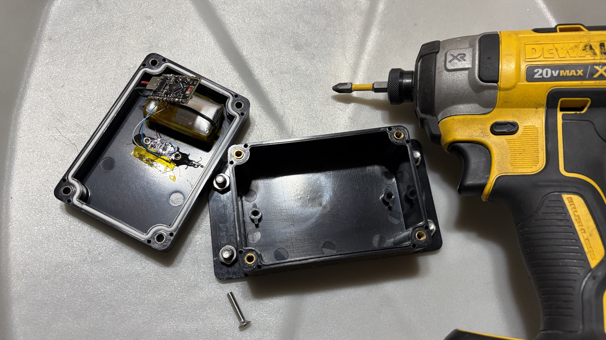

# Water Softener Salt Level Detector



ESP32-C6 SuperMini + VL53L0X time-of-flight sensor that measures the distance
to the salt surface inside a brine tank and reports it via Zigbee every 12 hours.
Battery level is reported alongside the distance.

## Hardware

| Component | Details |
|-----------|---------|
| MCU | MakerGO ESP32-C6 SuperMini |
| Sensor | VL53L0X ToF distance sensor (I2C) |
| Power | 4.2V Li-Ion battery |
| Mounting | Underside of brine tank lid |

### Wiring

| Signal | ESP32-C6 Pin |
|--------|-------------|
| I2C SDA | GP0 |
| I2C SCL | GP1 |
| VL53L0X XSHUT | GP2 |
| Battery ADC | GP5 (via 1MΩ + 1MΩ voltage divider) |
| Credentials clear | GP9 (BOOT button) |

The voltage divider uses two equal 1 MΩ resistors: `Vbat → R1 → GP6 → R2 → GND`.
This halves the battery voltage so it stays within the ESP32's ADC input range.

## Files

```
water_softener/
└── water_softener.ino              Arduino sketch
water_softener_converter.js          Zigbee2MQTT external converter
water_softener_debounce_ext.js       Zigbee2MQTT external extension (debounce)
```

---

## Build & Deploy

### Prerequisites

```bash
# Install arduino-cli (macOS)
brew install arduino-cli

# Initialize arduino-cli config
arduino-cli config init

# Add the Espressif board index
arduino-cli config add board_manager.additional_urls \
  https://raw.githubusercontent.com/espressif/arduino-esp32/gh-pages/package_esp32_index.json

# Update board index and install ESP32 core
arduino-cli core update-index
arduino-cli core install esp32:esp32

# Install VL53L0X library
arduino-cli lib install "VL53L0X"
```

### Compile

```bash
arduino-cli compile \
  --fqbn "esp32:esp32:makergo_c6_supermini:CDCOnBoot=cdc,ZigbeeMode=ed,PartitionScheme=zigbee" \
  water_softener
```

**Important:** `CDCOnBoot=cdc` enables USB CDC serial output. Without it, `Serial.printf()` produces no output.

Expected output: ~49% flash, ~10% RAM used.

### Find the Device Port

Plug in the ESP32-C6 via USB, then:

```bash
arduino-cli board list
```

Look for a USB serial port:
- **macOS**: `/dev/cu.usbmodem*` or `/dev/cu.usbserial-*`
- **Linux**: `/dev/ttyUSB*`
- **Windows**: `COM*`

Example output:
```
Port                          FQBN                                                   Type
/dev/cu.usbmodem21201         esp32:esp32:makergo_c6_supermini                       Serial Port (USB)
```

### Upload

```bash
arduino-cli upload \
  --fqbn "esp32:esp32:makergo_c6_supermini:CDCOnBoot=cdc,ZigbeeMode=ed,PartitionScheme=zigbee" \
  --port /dev/cu.usbmodem21201 \
  water_softener
```

Replace `/dev/cu.usbmodem21201` with your device port.

### Monitor Serial Output

```bash
arduino-cli monitor --port /dev/cu.usbmodem21201 --config baudrate=921600
```

Expected output on boot:
```
[ZB] Init
[ZB] Zigbee initialized
[ZB] Measurement: distance=42.3cm, battery=85%
[ZB] Attribute report sent
```

Press `Ctrl+C` to exit.

---

## Zigbee2MQTT Setup

### Converter Installation

Copy `water_softener_converter.js` to your Zigbee2MQTT `external_converters` directory and add it to `configuration.yaml`:

```yaml
external_converters:
  - water_softener_converter.js
```

Restart Zigbee2MQTT.

### Extension Installation (Debounce)

The device produces multiple messages per wake cycle due to Z2M's `publishLastSeen` mechanism republishing cached state. Install `water_softener_debounce_ext.js` to suppress duplicates and publish only fresh values.

#### Option A: SCP Deployment

```bash
# Copy extension to Z2M server
scp water_softener_debounce_ext.js \
  george@10.0.1.58:~/build/zigbee2mqtt-docker/data/external_extensions/
```

Add to `configuration.yaml`:

```yaml
external_extensions:
  - water_softener_debounce_ext.js
```

#### Option B: Docker Volume Mount (Development)

If running Z2M in Docker, mount the local directory:

```bash
docker run -d \
  --name zigbee2mqtt \
  -v /path/to/zigbee-water-softener:/app/data/external_extensions \
  koenkk/zigbee2mqtt
```

Edit locally; Z2M picks up changes on `docker restart zigbee2mqtt`.

#### Option C: Automated Deployment (GitHub Actions)

Create `.github/workflows/deploy-extension.yml`:

```yaml
name: Deploy Z2M Extension
on:
  push:
    paths:
      - water_softener_debounce_ext.js
jobs:
  deploy:
    runs-on: ubuntu-latest
    steps:
      - uses: actions/checkout@v3
      - uses: appleboy/scp-action@master
        with:
          host: ${{ secrets.Z2M_HOST }}
          username: ${{ secrets.Z2M_USER }}
          key: ${{ secrets.SSH_KEY }}
          source: "water_softener_debounce_ext.js"
          target: "~/build/zigbee2mqtt-docker/data/external_extensions/"
```

### Configuration

Add device config to `configuration.yaml`:

```yaml
devices:
  '0x58e6c5fffe171d98':
    friendly_name: water-softener-salt-level
    availability: false  # Disable Z2M's last_seen, let extension handle it
```

### Pairing

On first power-on (or after credential reset), the device enters commissioning mode and joins Zigbee2MQTT. Once paired, the device will publish distance and battery every ~12 hours (or sooner if values change significantly).

### Published Values

| Key | Type | Description |
|-----|------|-------------|
| `distance` | number (cm) | Distance from sensor to salt surface (0–200 cm) |
| `battery` | number (%) | Estimated battery charge (0–100%) |
| `linkquality` | number (LQI) | Zigbee signal strength (0–255) |

---

## Credential Reset

To re-pair the device with a different Zigbee network:

1. **Hold BOOT button** (GPIO9) while applying power or pressing RST
2. Keep held until serial monitor shows: `[ZB] Credentials erased`
3. Release — the device will start commissioning immediately

---

## Troubleshooting

### No serial output on monitor

**Cause:** `CDCOnBoot=cdc` missing from FQBN  
**Fix:** Recompile and reupload with the correct FQBN (see Compile section above)

### Device not appearing in Zigbee2MQTT

1. Check Z2M logs: `docker logs zigbee2mqtt | tail -50`
2. Verify the device is powered and can reach the Zigbee coordinator
3. Try credential reset (see above)

### Duplicate MQTT messages

**Cause:** Extension not loaded  
**Fix:** Verify `water_softener_debounce_ext.js` is in the `external_extensions` directory and listed in `configuration.yaml`

### Stale distance values

**Cause:** Extension not suppressing old cached state on reconnect  
**Fix:** Check Z2M logs for `WaterSoftenerDebounce extension started`. Ensure `availability: false` is set in device config.

---

## Configuration

All tunable values are `#define` constants at the top of `water_softener.ino`:

| Constant | Default | Description |
|----------|---------|-------------|
| `PIN_SDA` | `0` | I2C SDA pin |
| `PIN_SCL` | `1` | I2C SCL pin |
| `PIN_VL53_XSHUT` | `2` | VL53L0X power control pin |
| `PIN_BATT_ADC` | `6` | Battery ADC pin |
| `PIN_CLEAR_CREDS` | `9` | Credential-clear button pin |
| `SLEEP_INTERVAL_US` | 12 hours | Deep sleep duration |
| `BATT_DIVIDER_RATIO` | `2.0` | ADC multiplier (matches resistor ratio) |
| `BATT_MAX_MV` | `4200` | Battery voltage at 100% (mV) |
| `BATT_MIN_MV` | `3000` | Battery voltage at 0% (mV) |
| `SENSOR_READINGS` | `5` | Readings per measurement (drop high+low, avg rest) |
| `ZIGBEE_JOIN_TIMEOUT` | `30000` | Max ms to wait for Zigbee connection |
| `REPORT_TIMEOUT_MS` | `10000` | Max ms to wait for attribute report ACK |
